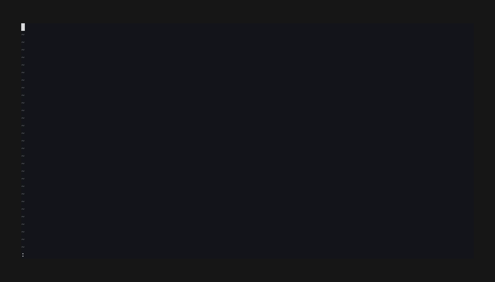

# codereview-annotator.nvim

[](https://github.com/felipeva/codereview-annotator.nvim/actions/workflows/test.yml?query=branch%3Amaster)
[](https://neovim.io)
[](LICENSE)

**Review a diff in Neovim. Annotate what needs work. Send the whole review to a coding agent
as one message.**



```
┌─ tree ──────────────────┐┌─ branch vs origin/master · ✓2/7 · +9 -4 ──────────────┐
│ ▾ apps              1/4 ││ ● ▾ apps/api/src/main.ts            +12 -3  [3 notes] │
│   ▾ api/src         1/2 ││ @@ -19,6 +19,8 @@ function boot()                     │
│     ▾ routes        0/1 ││  19 │  const app = express()                          │
│       ○ users.ts  +8 -2 ││ ▌20 │ -const cfg = load()                             │
│     ● main.ts    +12 -3 ││ ▌21 │ +const cfg = loadConfig()                       │
│   ▾ web/src         0/2 ││ ▌   │   ✗ why the rename? no callers were updated     │
│     ✓ index.ts    +2 -1 ││  22 │  app.listen(cfg.port)                           │
│ ○ README.md       +1 -0 ││                                                       │
│ 2/7 reviewed ██░░░░░░░░ ││ ✓ ▸ apps/api/src/routes.ts                      +4 -0 │
└─────────────────────────┘└───────────────────────────────────────────────────────┘
```

Unified or split layout, a file tree, reviewed-file collapsing, and a batch submit. Neovim
draws everything: no terminal, no browser.

`:help codereview` is the full reference. This README is the short version.

## Install

With [lazy.nvim](https://github.com/folke/lazy.nvim):

```lua
{
  "felipeva/codereview-annotator.nvim",
  cmd = { "CodeReview", "CodeReviewAnnotate", "CodeReviewSwitch" },
  opts = {},
}
```

Requires Neovim 0.12+ and `git`. Removing a commit from the **middle** of a branch review
([`gc`](#commit-list)) needs git 2.38+. Treesitter parsers are optional.

## Quick start

```
:CodeReview      open the diff of your branch
ab               annotate the line as a bug, write the note, <C-s> to queue it
R                mark the file reviewed (it collapses)
]F               go to the next unreviewed file
Q                read the queue, then <C-s> to submit the batch
```

With no [`send`](#adapters) adapter, the batch goes to the `+` register and stays queued.

## Commands

| Command | Action |
| --- | --- |
| `:CodeReview [scope]` | Open a review. No scope = the branch against its base |
| `:CodeReviewAnnotate [type]` | Annotate the current buffer or range, with or without a review |
| `:CodeReviewCopy` | Copy the batch to `+` without submitting it |
| `:CodeReviewLastBatch` | Show the last batch you sent |
| `:CodeReviewSwitch` | Move the review to another checkout (worktree) of this repo |
| `:CodeReviewBack` | Go back to the previous checkout |

Scopes:

```vim
:CodeReview                  " branch vs base (default)
:CodeReview staged           " the index
:CodeReview unstaged         " working tree vs index
:CodeReview worktree         " everything uncommitted
:CodeReview since-batch      " what changed since the last batch went out
:CodeReview HEAD~3           " any revspec
:CodeReview main...feature   " any range
```

## Keymaps

### Diff

| Key | Action |
| --- | --- |
| `ab` `af` `as` `an` `ai` | Annotate as bug / fix / suggestion / nitpick / issue |
| `aa` | Annotate, pick the type from a menu |
| `x` | Drop the annotation under the cursor |
| `e` | Edit its note |
| `ct` | Change its type |
| `R` | Toggle reviewed (collapses the file; in solo, goes to the next unreviewed) |
| `za` | Collapse / expand the file, without marking it |
| `<CR>` | Open the real file at this line, in a new tab |
| `gd` | Open the file in your diff tool ([`open_diff`](#adapters)) |
| `gs` | Cycle scope |
| `gr` | Reload from git |
| `gc` | Choose which branch commits to review ([commit list](#commit-list)) |
| `gS` | Switch to another checkout |
| `gl` | Toggle unified / split |
| `gw` | Toggle wrap of long lines (unified only) |
| `go` | Toggle solo: show one file at a time |
| `gp` | Show / hide the file tree |
| `gA` | Show / hide annotations already sent |
| `gb` | Show the last batch |
| `Q` | Open the queue |
| `gy` | Copy the batch to `+`, without submitting |
| `<C-t>` | Choose the delivery target |
| `<C-s>` | Submit the batch |
| `<C-a>` | Submit the batch with a preamble (a note above all annotations) |
| `q` | Close |

With more than one annotation on the line, `x`, `e` and `ct` open a list. The newest is
first.

### Navigation

| Key | Action |
| --- | --- |
| `]f` `[f` | Next / previous file |
| `]F` `[F` | Next / previous **unreviewed** file (wraps) |
| `]h` `[h` | Next / previous hunk |
| `]a` `[a` | Next / previous annotation |
| `<C-p>` | Go to a file by name |
| `<Tab>` | Move between the diff and the tree |

### File tree

| Key | Action |
| --- | --- |
| `<CR>` `o` | Open the file, or fold the directory |
| `h` `zc` / `l` `zo` | Collapse / expand the directory |
| `za` | Toggle the directory |
| `zM` / `zR` | Collapse / expand all |
| `]f` `[f` | Next / previous file |
| `R` | Toggle reviewed (on a directory: the whole subtree) |
| `gd` `<C-p>` | Same as in the diff |
| `gl` `gb` `gc` `gA` `gS` `gw` `go` | Same as in the diff |
| `<Tab>` / `gp` | Back to the diff / close the tree |
| `q` | Close |

### Composer

Opens in insert mode. `<C-s>` and `<C-t>` work in insert and normal mode.

| Key | Action |
| --- | --- |
| `<C-s>` | Queue the note, save an edit, or send an [immediate send](#annotate-from-any-buffer) |
| `<C-t>` | Choose where this note goes |
| `@` | Reference another file ([`pick_file`](#adapters)) |
| `<C-d>` | Discard a restored draft |
| `q` `<Esc>` | Close. Keep the text as a draft |

### Queue float (`Q`)

| Key | Action |
| --- | --- |
| `<CR>` | Go to the annotation |
| `e` | Edit its note |
| `t` | Change its type |
| `x` | Drop it |
| `gy` | Copy the batch to `+` (float stays open) |
| `<C-t>` | Choose the delivery target |
| `<C-s>` | Submit the batch |
| `<C-a>` | Submit with a preamble |
| `q` `<Esc>` | Close. Keep the queue |
| `?` | List all keys of the float |

### Last-batch float (`gb`)

Read-only. `q` or `<Esc>` closes it.

### Commit list

`gc` in a branch review. Newest commit first. Each row shows its size: `3f +212 -48`.

| Key | Action |
| --- | --- |
| `<Space>` | Put the commit in or out of the review |
| `<Space>` (visual) | Set all selected rows the same as the first row |
| `]c` `[c` | Next / previous checked commit |
| `<CR>` | Apply and close |
| `q` `<Esc>` | Close without changes |

Uncheck the oldest commits to start the review later in the branch. Uncheck a commit in the
middle (a formatter run, a rename) to skip only that one. Uncommitted work always stays in.
The plugin keeps the selection per branch.

## Annotations

| Type | Glyph | Key | Directive in the payload |
| --- | --- | --- | --- |
| bug | `✗` | `ab` | diagnose and fix these |
| fix | `✎` | `af` | apply these changes |
| suggestion | `✦` | `as` | evaluate; apply if sound |
| nitpick | `▫` | `an` | low priority — batch these together |
| issue | `⚑` | `ai` | do NOT fix — summarize these for tracking |

`aa` also offers **no type**: a note with no directive.

| Cursor on | Annotates |
| --- | --- |
| A diff line | That line |
| A visual selection | Those lines |
| A hunk header | The hunk |
| A file header, or a filler row in split | The file |

### Custom types

`opts.types` replaces the full set. Only `name` and `key` are required:

```lua
types = {
  { name = "bug",      key = "b", directive = "diagnose and fix these" },
  { name = "nitpick",  key = "n", directive = "ignore unless trivial" },
  { name = "question", key = "q" },  -- binds `aq`
}
```

Start from `require("codereview.types").defaults`. See `:help codereview-annotations`.

### Annotate from any buffer

No review is necessary. Normal mode captures the file; a visual selection or a range captures
those lines. Errors and warnings on those lines are attached to the note.

```lua
vim.keymap.set({ "n", "x" }, "<leader>ab", function()
  require("codereview").annotate("bug")
end, { desc = "Annotate as a bug" })

vim.keymap.set({ "n", "x" }, "<leader>aa", function()
  require("codereview").annotate()  -- pick the type
end, { desc = "Annotate" })

-- Send one annotation now, without the queue:
vim.keymap.set({ "n", "x" }, "<leader>aB", function()
  require("codereview").annotate("bug", nil, { immediate = true })
end, { desc = "Send a bug now" })
```

```vim
:12,20CodeReviewAnnotate bug
```

## The payload

Annotations are grouped by type, in the configured order. An optional preamble (`<C-a>`)
goes first.

````markdown
the auth rewrite is the part to read — the route moves are mechanical

Code review — 4 annotations on branch vs origin/master (8 files, 6 reviewed)

## Bugs (2) — diagnose and fix these

### 1. @apps/api/src/main.ts#L20-21

why the rename? no callers were updated

### 2. apps/api/src/routes.ts:14 (deleted)
```diff
-router.use(legacyAuth)
```

was this dropped on purpose?

## Untyped (1)

### 3. @apps/api/src/db.ts#L8

worth a look before we ship this
````

After a submit, `:CodeReview since-batch` shows what the agent changed. The winbar shows
`↺N`: the number of annotated files the agent did not touch.

## Configuration

Defaults:

```lua
opts = {
  context = 3,                   -- git diff -U
  untracked = true,              -- show untracked files
  syntax = true,                 -- treesitter highlighting
  max_syntax_bytes = 256 * 1024,
  layout = "unified",            -- or "split"  (toggle: gl)
  spans = true,                  -- highlight the changed characters inside a line
  wrap = false,                  -- (toggle: gw)
  solo = false,                  -- one file at a time (toggle: go)
  archived = true,               -- show sent annotations, dimmed (toggle: gA)
  muted = { enabled = true, strength = 0.5 },         -- dim the pane without focus
  faded = { enabled = true, strength = 0.35 },        -- dim the files you are not in
  counterpart = { enabled = true, strength = 0.25 },  -- mark the opposite row in split
  panel = { enabled = true, width = 34, position = "left" },
  icons = {
    reviewed = "✓", annotated = "●", unreviewed = "○",
    collapsed = "▸", expanded = "▾", change_bar = "▌",
    untouched = "↺", continuation = "↳",
    progress_full = "█", progress_empty = "░",
  },
  types = nil,                   -- the five types above
}
```

All highlights are `CodeReview*` groups linked with `default = true`, so your colorscheme
can override them. See `:help codereview-highlights`.

## Adapters

All optional. They connect the plugin to your agent, pickers and icons.

| Adapter | Supplies | Default |
| --- | --- | --- |
| `send(payload, target)` | Delivers the batch. Return `false, reason` on failure | `+` register |
| `pick_target(cb)` | A target `{ short, cwd }` | None |
| `pick_file(cb)` | A file for `@` in the composer | `@` is literal |
| `compose(ctx, on_accept, label)` | The note editor | Built-in composer |
| `open_diff(spec)` | Opens a file in your diff tool (`gd`) | `gd` not mapped |
| `pick_checkout(checkouts, cb)` | The checkout picker | Built-in picker |
| `file_icon(path)` | Glyph and highlight group for a file | None |
| `dir_icon(path)` | Glyph and highlight group for a directory | None |

```lua
opts = {
  send = function(payload, target)
    vim.fn.setreg("+", payload)  -- replace with your agent delivery
    return true
  end,
  open_diff = function(spec)  -- { path, before, after, line }
    local rev = spec.after and (spec.before .. ".." .. spec.after) or spec.before
    vim.cmd(("DiffviewOpen %s -- %s"):format(rev, vim.fn.fnameescape(spec.path)))
  end,
  file_icon = function(path)
    return require("nvim-web-devicons").get_icon(path, nil, { default = true })
  end,
  dir_icon = function(path)
    return MiniIcons.get("directory", vim.fs.basename(path))
  end,
}
```

Full contracts: `:help codereview-adapters`. Wiring to a Claude session over herdr:
[`docs/herdr.md`](docs/herdr.md).

## Persistence

The queue, reviewed marks, commit selections and sent batches persist per checkout, under
`stdpath("state")/codereview/`. If a file changes, its reviewed mark is removed and its
annotations are marked `⚠ stale`.

## Documentation

| Where | What |
| --- | --- |
| `:help codereview` | Full reference |
| [`docs/rationale.md`](docs/rationale.md) | Why the behavior is what it is |
| [`docs/adr/`](docs/adr/) | Architecture decisions |
| [`CONTEXT.md`](CONTEXT.md) | Project vocabulary |
| [`docs/design-notes.md`](docs/design-notes.md) | Non-obvious constraints |

## Development

```sh
make hooks   # install the commit-msg hook
make deps    # clone plenary into .tests/
make all     # lint + full suite (~5s). Run before every commit
make perf    # timing report, not a gate
```

See [`CONTRIBUTING.md`](CONTRIBUTING.md) and [`tests/README.md`](tests/README.md). Open an
issue first for anything with a design decision behind it. Security reports go through
[`SECURITY.md`](SECURITY.md).

This plugin was written with [Claude Code](https://claude.com/claude-code). Agent-assisted
contributions are welcome; [`CLAUDE.md`](CLAUDE.md) has the workflow.

## License

[MIT](LICENSE) © Felipe Valencia
